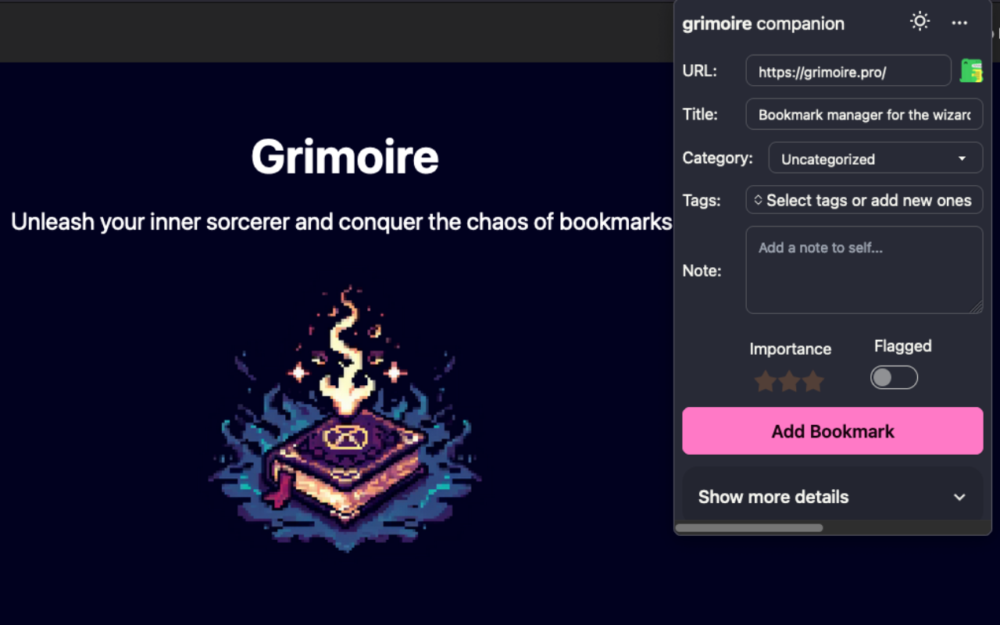

<div align="center">
  
  <h1>grimoire companion</h1>
  <p>Web extension for Grimoire - a bookmark manager for the wizards 🧙</p>


</div>
<br>

Adding bookmarks to Grimoire is now easier than ever! With the Grimoire Companion, you can add bookmarks to your Grimoire account directly from your browser. Just click the extension icon, select the category and tags, and press "Add Bookmark" - it's that simple!

## Features

- add bookmarks to your Grimoire account directly from your browser 🔖
- create new tags as you add bookmarks 🏷️
- specify the importance and/or flag the bookmark ⭐
- automatically fetch metadata from the website using the browser's API 🫶
- choose if you want to add a screenshot of the website 📸

<div align="center">
  
</div>

## How to get it?

- [Firefox Add-ons](https://addons.mozilla.org/en-GB/firefox/addon/grimoire-companion/)
- [Chrome Web Store](https://addons.mozilla.org/en-GB/firefox/addon/grimoire-companion/)
- Microsoft Edge Add-ons [to be published]

## Development

### Prerequisites

- [Node.js](https://nodejs.org/en/download/)
- [PNPM](https://pnpm.io/installation)

### Steps

```bash
# Clone the repository
git clone https://github.com/goniszewski/grimoire-web-extension

# Install the dependencies
pnpm i

# Run the development version
pnpm dev

# Build the production version (by default, this will create the Chrome extension for local development in `build/chrome-mv3-prod`)
pnpm build
```

[How to load the extension in Chrome-based browsers](https://docs.plasmo.com/framework#loading-the-extension-in-chrome)

## Development

Check out the [the official Plasmo documentation](https://docs.plasmo.com/) to learn more.

## Roadmap

- [x] Initial release (0.1.0) 🚀

We're open to suggestions and feature requests! If you have an idea for a feature, please [open an issue](https://github.com/goniszewski/grimoire-web-extension/issues).

## Contributing

If you want to contribute to the project, please read the [contributing guide](CONTRIBUTING.md).

## License

This project is licensed under the [MIT License](LICENSE).

## Credits

Special thanks to: [DaisyUI](https://github.com/saadeghi/daisyui),
[Plasmo](https://docs.plasmo.com),
[Svelte](https://github.com/sveltejs/svelte),
[Svelte French Toast](https://github.com/kbrgl/svelte-french-toast),
[Svelte MultiSelect](https://github.com/janosh/svelte-multiselect),
[Tailwind CSS](https://tailwindcss.com)
